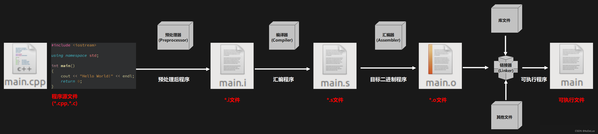
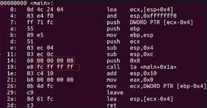

# c/c++程序的编译过程
## 一、何为编译？
编译是一种将程序的**源代码**转化为计算机能够理解并执行的**机器代码**的过程，类似于翻译。

在这个变化过程中的大致流程为：

**源文件———>汇编程序———>二进制程序———>可执行程序**

## 二、编译器的作用

如gcc等编译器，其实并不只是参与流程中的编译进程，它是一系列工具的集合，将通过一系列步骤最终生成可执行的.exe文件，一图以盖之如下：



## 三、编译器运作的具体步骤
### 预处理（Preprocess）
这一部分主要是对源文件中的**伪指令**和特殊符号进行处理，伪指令即为以#开头的那些指令，包括宏定义（#define等）,条件编译指令（#if,#ifdef等）和头文件（#include）等，例如：

* 删除#define，将宏展开，即把其代表的实际内容替换到程序文本中。
* 处理条件编译指令，如#if,#ifdef,#ifndef,#else,#elif,#endif。
* 将#include包含的头文件内容插入文件，如果有多重包含则递归执行。
* 删除注释（//和/**/）
* 添加行号和文件标识，以便产生调试用的行号信息，以及出现编译错误或警告时打印行号。

在此过程后，会产生一个以.i为扩展名的新cpp文件，即为预处理的成果。

### 编译（Compilation）
这一步是转换的主要进程，通过后即可产生汇编语言的程序.s文件。而其工作中又分为三个主要部分：
* **词法分析：** 这个阶段编译器会将源程序的文本内容逐个字符读入，然后根据语言的构词规则识别文本中的单词符号，此过程得到的结果通常是一个二元组，即单词种别和单词自身的值。
* **语法分析：** 这个阶段在词法分析的基础上，将单词序列组合成各类语法短语，如程序中常见的“语句”，“表达式”等，相当于搭建起了整个程序的结构，如果出现问题则会发生报错或警告。
* **语义分析：** 语义分析是编译的一个逻辑阶段，它解释信息每个部分的意义，规定了要发出何种控制信息，以及完成什么样的动作，做出什么样的响应，将结构正确的程序进行上下文有关性质的检查，并报告错误。可以说，在这一阶段，编译器才真正读懂了程序的具体含义。

## 汇编（Assemoly）
此过程由汇编器完成，将.s文件的汇编代码转换为二进制机器代码，并生成.o的目标文件。此时他的字节编码是机器语言指令而不是字符，如果用文本编辑器直接打开只能看到乱码。

至此，代码语言的转换已经进行完毕。例如，原来的代码可能是这样：
```c++
#include <iostream>
using namespace std;
int main()
{
    cout<<"Hello world!"<<endl;
    return 0;
}
```
经过一系列处理后却是这样：



## 链接（Linking）
但是，此时的文件却还无法执行，因为编译时编译器只对单个文件进行处理，如果该文件里面需要引用到其他文件中的符号，比如全局变量或者调用了某个库函数中的函数，那么这时候，在这个文件中该符号的地址是没法确定的，只能由链接器把所有的目标文件链接到一起才能确定最终的地址，并生成最终的可执行文件。

例如，程序调用了cout函数，cout函数存在于一个名为iostream.o的单独的预编译好了的目标文件中，而这个文件必须以某种方式合并到我们的程序中。链接器就负责处理这种合并，最终得到一个可执行文件，可以被加载到内存中，由系统执行。
